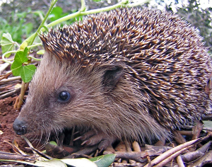

# Blurhash

A Clojure implementation of [Blurhash](https://blurha.sh/).

Blurhash is an algorithm by [Dag Ågren](https://github.com/DagAgren) of [Wolt](https://wolt.com) that decodes an image to a very compact (~ 20-30 bytes) ASCII string representation, which can be then decoded into a blurred placeholder image. See the [main repo](https://github.com/woltapp/blurhash) for the rationale and details. 

## Usage

The encode->hash->decode cycle looks something like this:

 -> `UIGuXhS@x[xX_MORbuoy?uNGM{nTNHMzIVnn` -> 

The Clojure implementation is written in CLJC files, so that they can be used from Clojure and ClojureScript code alike.

TODO: examples...
